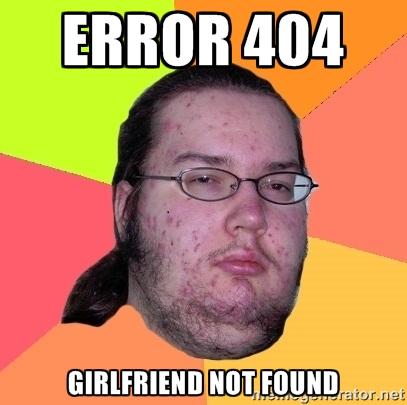
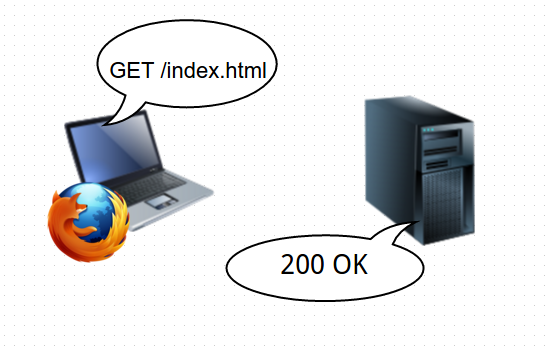
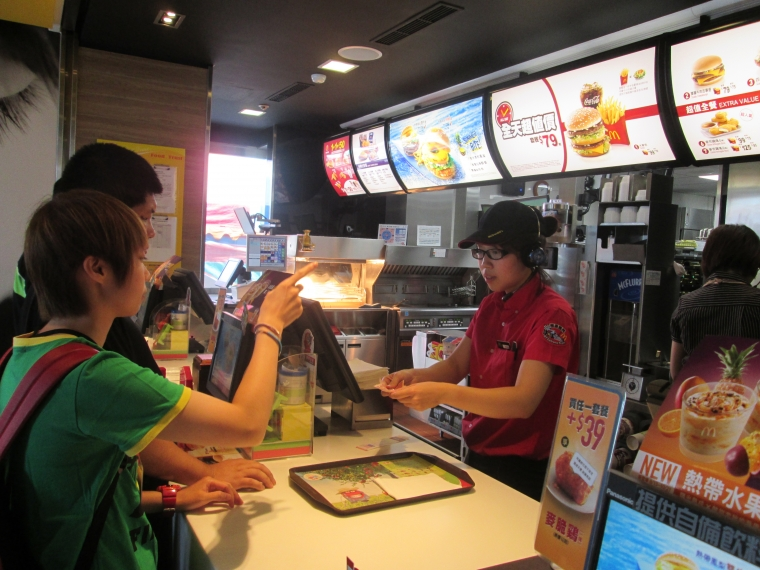
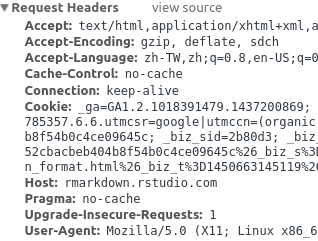
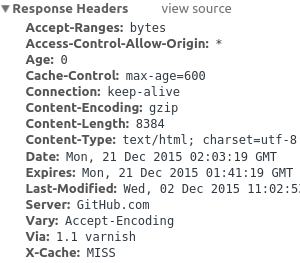
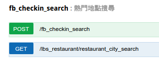
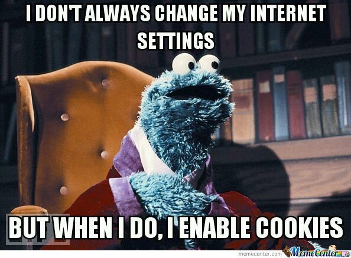
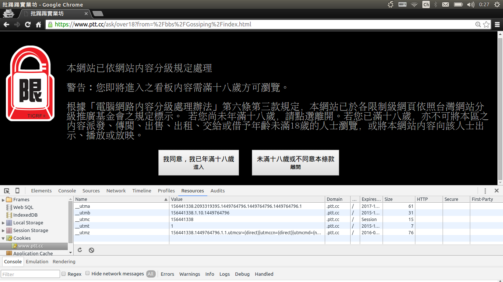
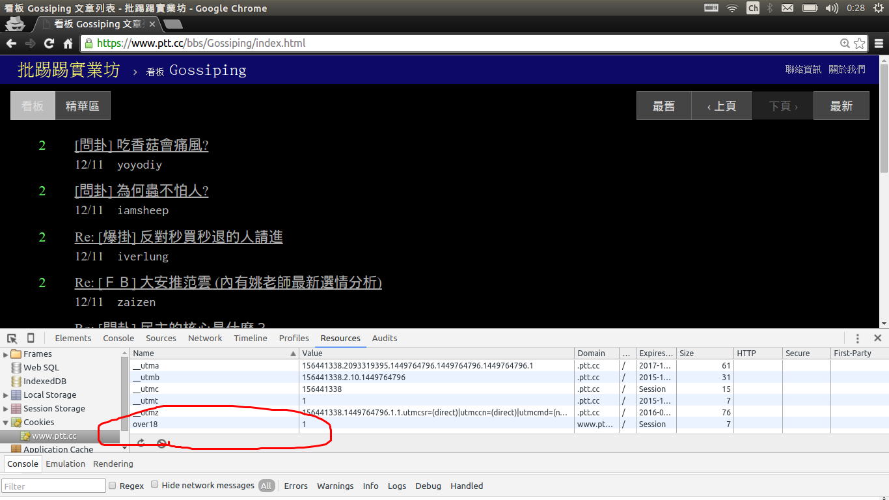

## Agenda

### HTTP request
### Session / cookies


# HTTP request



## 開發者了解 HTTP 請求 能處理更多爬蟲情境

- rvest 讓我們模仿使用瀏覽器的方式造訪網站，取得表格與表單
- 親自發出HTTP請求的使用情境仍然很多
- 例如：API的文件會註明使用何種 HTTP 請求方式取得資料

## 客戶端透過「動詞」與「URI」和伺服器請求服務




<div class="notes">


</div>


## headers: 客戶端和伺服器的對話有更多細節




## API 文件註明「動詞」與「 URI 」

...還有其他需要填寫的參數

接下來會用資策會 [SER API](http://api.ser.ideas.iii.org.tw/docs/#!/fb_fanpage_search) 示範如何依照文件指示取得資料



## 使用 httr套件

```{r}
library(httr)
```

- httr::POST
- httr::GET

## GET把所有請求參數放在URL裡

尋找餐廳資訊
```{r}
res = httr::GET("http://api.ser.ideas.iii.org.tw:80/api/lbs_restaurant/restaurant_city_search?sort=score&token=api_doc_token&limit=5")

# 用content取出回傳的內容
str(content(res))
```

## 用神奇的magrittr語法讓程式變漂亮吧

```{r}
library(magrittr)
res %>% content %>% str
```


## POST 的請求參數以 list 放在 body 中

透過經緯度座標、半徑搜尋一週內Facebook上的熱門打卡點

```{r}
res = httr::POST(
  url = "http://api.ser.ideas.iii.org.tw:80/api/fb_checkin_search",
  body = list(
    coordinates="25.041399,121.554233",
    radius="0.1",
    token = "api_doc_token"), 
  encode = "form")

res %>% content %>% str
```

<div class="notes">

```{r}
res %>% content %>% .$result %>% lapply(unlist) %>% do.call(rbind, .) -> x
x
```

</div>


# Session / cookies



## 爬蟲送出對的動詞與 URI 不一定拿得到想要的資源

- HTTP 請求的細節會影響伺服器是否想給你資料
- 伺服器的程式可能根據請求細節下判斷，是否回傳資料
- 例如：Cookie是否狀態正確？

<div class="notes">
- 還有那些沒 cover 到的：User-agent。
</div>

## Cookies 記錄客戶端狀態 </br> Session 是使用者與網站互動歷程

- Cookies：瀏覽器的變數，用來簡單記錄使用者的狀態。
- Session：原意是指使用者進入網站到離開網站的這段互動的時間。一般來說客戶端或伺服端一方要記錄互動的狀態。Cookie是常見客戶端用來記錄使用者互動的方式。

- rvest::html_session

<div class="notes">

- HTTP無狀態，影響互動實作
- 購物頁面範例：結帳時怎麼知道買了什麼東西？ 那用GET參數記錄狀態？
- 下次自動登入
- Cookie會過期

</div>

## Ptt 八卦版18禁詢問頁面 讓爬蟲程式無法進到文章列表

```{r message=FALSE}
library(rvest)
read_html("https://www.ptt.cc/bbs/Gossiping/index.html") %>% html_text(trim = T)
```

## 必須持有over18的cookie 伺服器才不會重導向



## 必須持有over18的cookie 伺服器才不會重導向




## 使用rvest的session物件記錄cookie

```{r}
session = rvest::html_session(url = "https://www.ptt.cc/bbs/Gossiping/index.html")

form = session %>%
  html_node("form") %>%
  html_form()

session_redirected = rvest::submit_form(session = session, form = form )
```

## 在重導向的Session物件中取得資料

```{r}
session_redirected %>%
  html_node("body") %>%
  html_nodes(".title") %>%
  html_text(trim=T)

```

## Session物件幫我們保留了Cookie

```{r eval=FALSE}
session_redirected %>% cookies
```


```{r echo=FALSE}
library(knitr)
session_redirected %>% cookies %>% kable
```


## References

- [httr quickstart guide](https://cran.r-project.org/web/packages/httr/vignettes/quickstart.html)

### 延伸閱讀
- [HTTP: The Protocol Every Web Developer Must Know - Part 1](http://code.tutsplus.com/tutorials/http-the-protocol-every-web-developer-must-know-part-1--net-31177) 淺白的 HTTP 協定介紹文章


- [What are sessions? How do they work?](http://stackoverflow.com/questions/3804209/what-are-sessions-how-do-they-work) 對Session有淺白的介紹